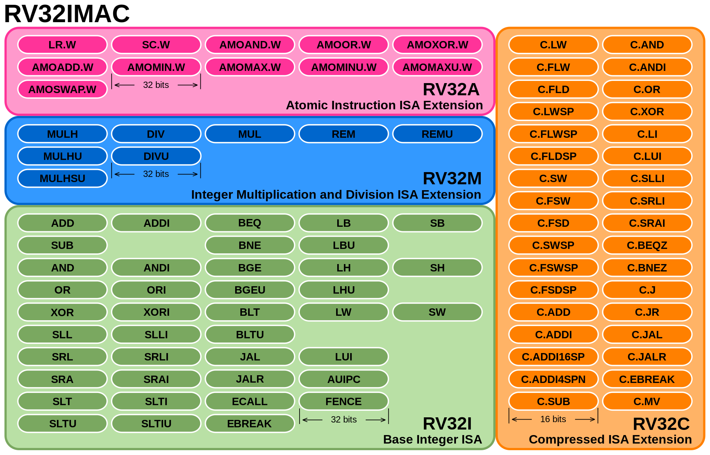
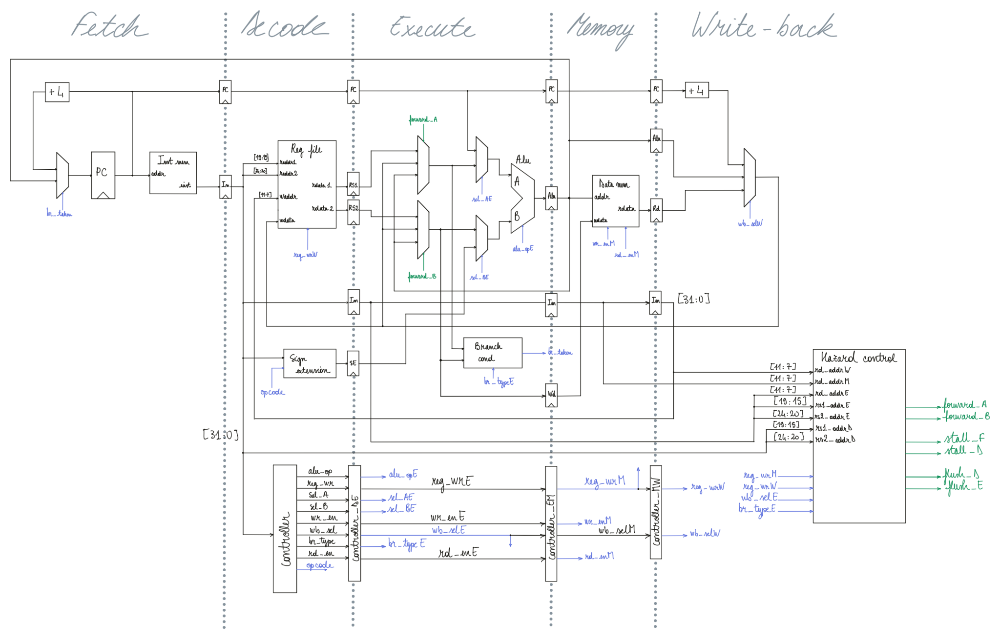
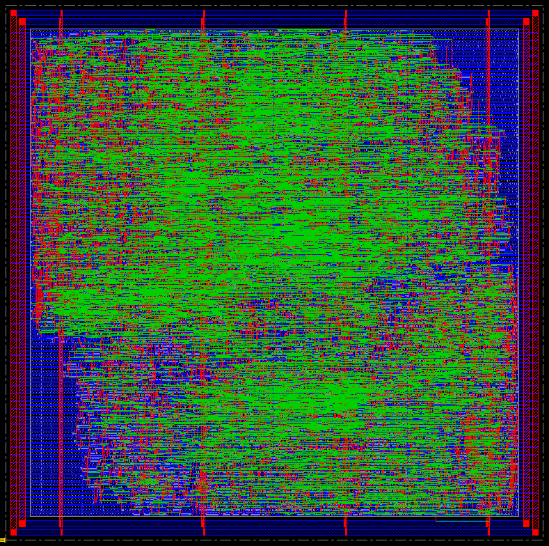

# RISC-V 32-bit Processor Design (AMS 0.35µm)

## 📌 Project Overview

This project focuses on the complete ASIC design and physical implementation of a 32-bit RISC-V processor, utilizing the **AMS 0.35µm** technology node. The architecture is based on a classic **5-stage pipeline** (Fetch, Decode, Execute, Memory, Write-Back) and includes hazard control and data forwarding units.

The design flow covers the entire back-end process, from RTL synthesis using **Synopsys Design Compiler** to physical implementation in **Cadence Innovus**, achieving **Timing Closure** and **Internal DRC/Connectivity verification** within the implementation environment.

---

## 📖 Instruction Set Architecture (ISA)
For this implementation, we selected the **RV32I** Base Integer Instruction Set. 
- **No Extensions**: To maintain a lean and efficient hardware footprint, we implemented the base integer set without optional extensions (such as M, A, F, or D).
- **Fixed Length**: All instructions are 32 bits wide, simplifying the Fetch and Decode stages.

---

## 🏗 Architecture Diagram
The processor was designed to maximize throughput while handling complex data hazards without stalling the pipeline unnecessarily. 

---

## 📊 Post-Routing Specifications
The following specifications represent the final metrics achieved after full placement, Clock Tree Synthesis (CTS), and routing in Cadence Innovus. 

| Category | Characteristic | Result |
| :--- | :--- | :--- |
| **General** | Technology | **AMS 0.35 µm** (350 nm) |
| | Supply Voltage | **3.0 V** |
| **Performance** | **Max Frequency ($F_{max}$)** | **22.9 MHz** |
| | Target Clock Period | 50 ns (20 MHz) |
| | Setup Timing Margin (WNS) | +6.373 ns |
| | Hold Timing Margin (WNS) | +0.162 ns |
| **Physical** | Total Chip Area | **3.3 mm²** |
| | Total Cell Area (Logic) | 964,345 µm² |
| | Logic Gate Count | 8,141 cells |
| | Placement Density | 35.2 % |
| | Total Wire Length | 1.26 meters |
| **Power** | **Total Power Consumption** | **28.18 mW** |
| | Leakage Power | 0.022 mW (Negligible) |
| **Validation** | Timing Violations (Setup/Hold) | **0** |
| | Physical Violations (DRC/Antenna) | **0** |

---

## 🎨 Physical Layout & Routing
The physical design was carried out with a strong focus on optimizing the critical paths (especially the branch resolution logic) and preventing congestion around the heavily utilized Register File. 

The image below shows the final routed chip, including the power rings, power stripes, and metallic signal layers:

---

## 🛠 Physical Implementation Flow
The ASIC physical design followed an industry-standard flow:
1. **Synthesis**: Logic synthesis performed with Synopsys Design Compiler to generate the gate-level netlist.
2. **Floorplanning**: Core utilization set to ~35% (pure gate density) with a robust power ring and stripes definition to prevent IR drop.
3. **Placement**: Standard cell placement with pre-CTS optimization.
4. **Clock Tree Synthesis (CTS)**: Generation of a balanced clock tree to minimize clock skew across the 5 pipeline stages.
5. **Routing**: Global and detailed routing using NanoRoute, followed by intensive post-route optimization for hold-time fixing.
6. **Sign-off**: Final timing analysis (OCV mode) and full DRC/Antenna verification.

---

## 📚 References & Acknowledgments
This project was developed as part of the engineering curriculum at **Grenoble-INP Phelma**.

### External Resources
- [RV32I Introduction - Bit-Spinner](https://www.bit-spinner.com/rv32i/rv32i-introduction): Comprehensive guide on the RV32I instruction set used during the design phase.

### Academic Institution
**Grenoble-INP-PHELMA, UGA** *Graduate School of Engineering in Physics, Electronics, Materials Sciences* - Address: 3 Parvis Louis Néel, 38000 Grenoble, France  
- Website: [http://phelma.grenoble-inp.fr](http://phelma.grenoble-inp.fr/en)

---